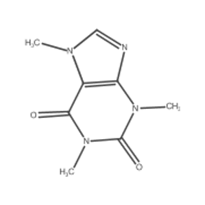
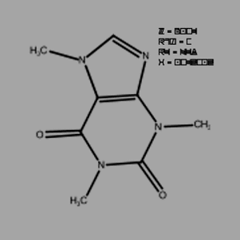

[](https://opensource.org/licenses/MIt)
[](https://github.com/OBrink/RanDepict/graphs/commit-activity)

[](https://GitHub.com/OBrink/RanDepict/issues/)
[](https://GitHub.com/OBrink/RanDepict/graphs/contributors/)
[](https://GitHub.com/OBrink/RanDepict/releases/)
[](https://pypi.python.org/pypi/RanDepict/)

[](https://doi.org/10.5281/zenodo.5531702)
[](https://randepict.readthedocs.io/en/latest/?badge=latest)


This repository contains RanDepict, an easy-to-use utility to generate a big variety of chemical structure depictions (random depiction styles and image augmentations) based on RDKit, CDK, Indigo and PIKAChU.

## Usage
-  To use RanDepict, clone the repository to your local disk and make sure you install all the necessary requirements.

### Installation

```shell
$ git clone https://github.com/OBrink/RanDepict.git
$ cd RanDepict 
$ python -m pip install -U pip #Upgrade pip
$ pip install .
```

### Alternative
```shell
$ python -m pip install -U pip #Upgrade pip
$ pip install git+https://github.com/OBrink/RanDepict.git
```

### Install from PyPI
```shell
$ pip install RanDepict
```

### Development

> **Note**
> We recommend using RanDepict inside a Conda environment to facilitate the installation of the dependencies.
- Conda can be downloaded as part of the [Anaconda](https://www.anaconda.com/) or the [Miniconda](https://conda.io/en/latest/miniconda.html) plattforms (Python 3.8). We recommend `miniconda3`. On Linux you can get it with:

```shell
$ wget https://repo.anaconda.com/miniconda/Miniconda3-latest-Linux-x86_64.sh
$ bash Miniconda3-latest-Linux-x86_64.sh
```

```shell
$ echo -e "channels:\n - conda-forge\n - nodefaults" > ~/.condarc
$ conda update conda
$ conda install conda-libmamba-solver
$ conda config --set experimental_solver libmamba
$ conda create --name RanDepict python=3.8
$ conda activate RanDepict
# pypi has rdkit so not necessary to install it using conda
# $ conda install -c rdkit rdkit
$ pip install -e ".[dev]" # will install pytest and tox
# To run tests for python 3.8
$ tox -e py38
```

### Basic usage: 
```python
from RanDepict import RandomDepictor

smiles = "CN1C=NC2=C1C(=O)N(C(=O)N2C)C"

with RandomDepictor() as depictor:
    image = depictor(smiles)
``` 

Have a look at the [examples in our demo notebook](https://github.com/OBrink/RanDepict/blob/main/examples/RanDepictNotebook.ipynb). A more detailed [documentation is provided here](https://randepict.readthedocs.io/en/latest/).

Here are some examples of depictions of caffeine without augmentations (left) and with augmentations (right) that were automatically created using RanDepict. 

   


## Cite Us

- Brinkhaus, H.O., Rajan, K., Zielesny, A. et al. RanDepict: Random chemical structure depiction generator. J Cheminform 14, 31 (2022). https://doi.org/10.1186/s13321-022-00609-4

## Acknowledgements

- We would like to thank [M. Isabel Agea](https://github.com/Iagea) and [Tulay Muezzinoglu](https://github.com/tulay) for their valuable contributions.

## More information about our research group

[](https://cheminf.uni-jena.de)


